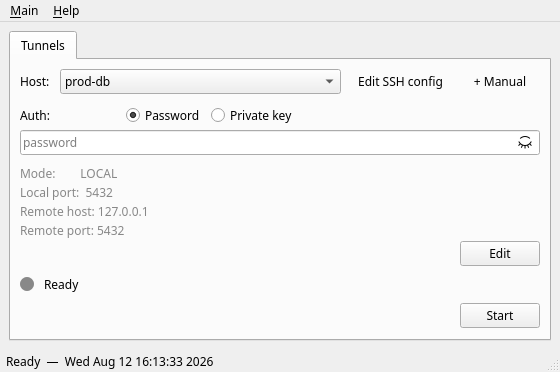

# ProxYme

[](https://github.com/dsalazarCazanhas/ProxYme/actions/workflows/ci.yml)
[](LICENSE)

A lightweight SSH tunnel manager with a PySide6 GUI for Windows and Linux.



## What it does

- Reads SSH hosts from `~/.ssh/config` and lists them in a combo box
- For each host, resolves tunnel topology (mode, ports, remote host) from SSH config; missing fields can be filled in the UI and are persisted to `~/.proxyme/tunnels.json` (non-sensitive fields only, owner-only permissions)
- Supports **LOCAL** (`-L`) and **DYNAMIC** (`-D` / SOCKS5) forwarding modes
- **Manual entries** — add ad-hoc tunnel configs (host, user, port, key) without touching the SSH config; stored in memory only for the session
- **Auth** — password or private key (with passphrase prompt if needed); switchable per session via radio buttons regardless of what the SSH config says
- **TOFU host key verification** — unknown hosts prompt for trust on first connect; changed keys are rejected with a warning
- Single-instance lock, log rotation, graceful close with active tunnel confirmation

## Stack

- Python 3.11+
- PySide6 6.x
- paramiko 4.x

## Run

```bash
uv sync
uv run python main.py
```

Check which version you're running with `uv run python main.py --version`.

## Contributing

See [CONTRIBUTING.md](CONTRIBUTING.md) for setup, tests, and lint instructions.
